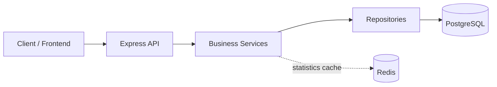
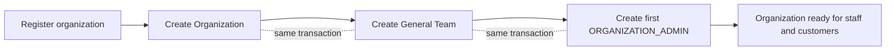
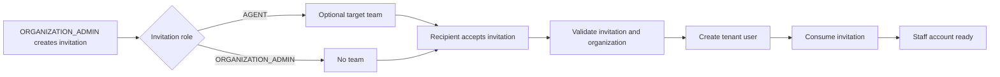
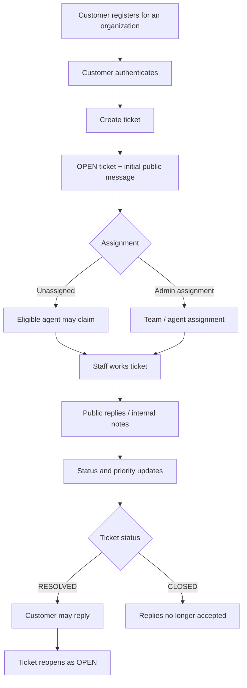
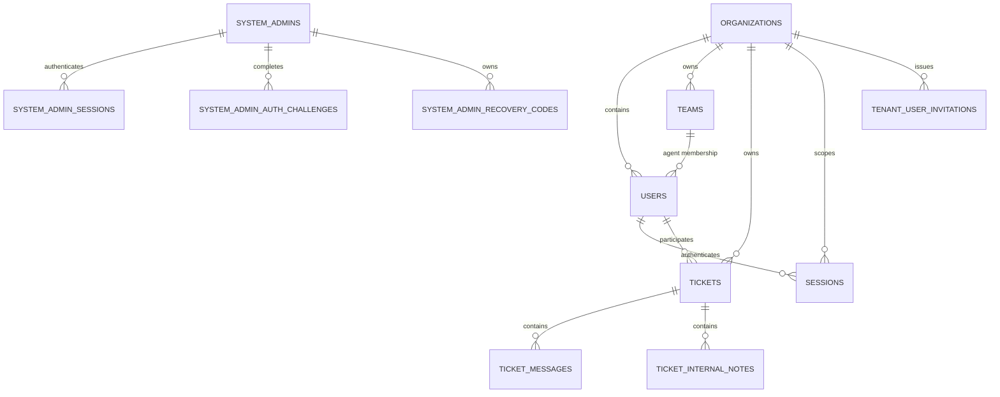
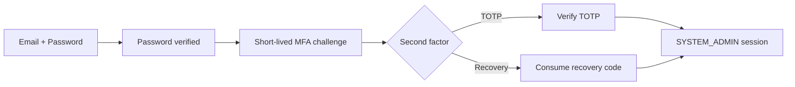
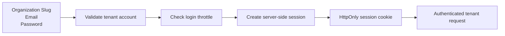
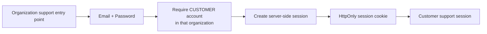
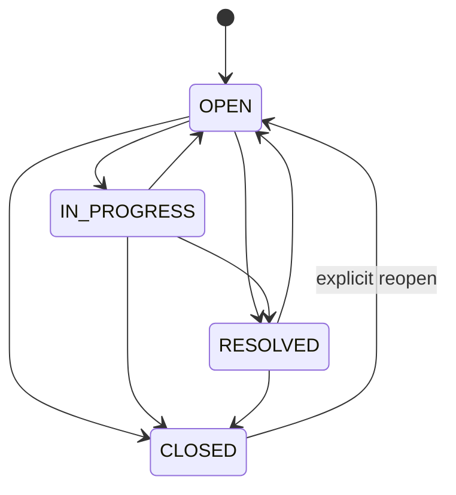

# Multi-Tenant Helpdesk

A backend-focused helpdesk platform where multiple organizations can manage their own support operation while sharing the same application infrastructure.

Each organization acts as an isolated tenant with its own users, teams, invitations, tickets, sessions, and statistics. Customers create support tickets, agents work tickets according to assignment and team rules, organization administrators manage their support operation, and a separate `SYSTEM_ADMIN` identity handles platform-level administration.

The project focuses on backend problems that appear once a system moves beyond basic CRUD: **tenant isolation, authentication, authorization, relational integrity, concurrency, caching, and observability**.

## Table of Contents

- [Engineering Highlights](#engineering-highlights)
- [System Overview](#system-overview)
- [Technology Stack](#technology-stack)
- [Core Workflows](#core-workflows)
- [Domain Model](#domain-model)
- [Database Relationships](#database-relationships)
- [Application Architecture](#application-architecture)
- [Multi-Tenancy & Authorization](#multi-tenancy--authorization)
- [Authentication Design](#authentication-design)
- [Ticket Domain & Lifecycle](#ticket-domain--lifecycle)
- [Statistics & Redis Caching](#statistics--redis-caching)
- [Observability](#observability)
- [Frontend Integration Guide](#frontend-integration-guide)
- [API Documentation](#api-documentation)
- [Getting Started](#getting-started)
- [Project Structure](#project-structure)
- [Engineering Decisions & Trade-offs](#engineering-decisions--trade-offs)
- [Challenges & Solutions](#challenges--solutions)
- [Known Limitations & Deliberate Boundaries](#known-limitations--deliberate-boundaries)
- [Project Purpose & Development Approach](#project-purpose--development-approach)

---

## Engineering Highlights

- **Multi-tenant isolation** — tenant identity comes from authenticated context, not from a client choosing an organization ID.
- **Server-side authentication** — opaque PostgreSQL-backed sessions, HttpOnly cookies, CSRF protection, expiry, revocation, and login throttling.
- **Separate platform administration** — `SYSTEM_ADMIN` uses its own authentication flow, sessions, MFA, and recovery codes.
- **Authorization beyond roles** — ticket access can depend on ownership, team membership, assignment, and current ticket state.
- **Concurrency-aware business rules** — transactions, conditional updates, and row locks protect operations such as ticket claiming and lifecycle changes.
- **Redis-backed statistics** — Redis caches derived statistics while PostgreSQL remains the source of truth.
- **Structured observability** — request IDs, structured logs, and HTTP metrics make application behavior easier to inspect.

---

## System Overview

The backend is organized around a straightforward request flow:



The main idea is simple:

- **Express** handles HTTP concerns.
- **Services** contain business rules and authorization decisions.
- **Repositories** contain persistence logic.
- **PostgreSQL** stores authoritative application state.
- **Redis** is used only for short-lived derived statistics.

This keeps business logic separate from HTTP handling and database access without introducing unnecessary architectural layers.

---

## Technology Stack

| Technology | Role |
| --- | --- |
| **Node.js** | Backend runtime |
| **TypeScript** | Static typing |
| **Express** | HTTP API and middleware |
| **PostgreSQL** | Main relational database and source of truth |
| **Kysely** | Typed SQL/query construction |
| **Redis** | Short-lived statistics cache |
| **Zod** | Runtime validation |
| **Argon2id** | Password hashing |
| **otplib** | TOTP-based MFA for `SYSTEM_ADMIN` |
| **Pino** | Structured logging |
| **@prometheus-io/client** | HTTP metrics |
| **Vitest / Supertest** | Automated testing |

The stack is intentionally small. Technologies were added because they solve a concrete requirement in the project, not simply to increase the number of tools used.

---

## Core Workflows

### Organization onboarding



Registration creates the organization, its protected **General** team, and the first organization administrator together.

The administrator can then create teams and invite additional staff, while customers can register through the organization's public support entry point.

### Staff onboarding



Agent invitations may target a specific team.

If no valid target team is available when the invitation is accepted, the agent joins the organization's **General** team.

### Customer support flow



Assignment and workflow status are independent. Assigning a ticket does **not** automatically move it to `IN_PROGRESS`.

Public messages form the customer/staff conversation, while internal notes are staff-only.

A customer reply to a `RESOLVED` ticket reopens it to `OPEN`. A `CLOSED` ticket remains readable but does not accept replies until reopened.

Voiding is separate from workflow status, so invalid, spam, duplicate, or withdrawn tickets can be removed from normal operational views without pretending that their workflow state changed.

---

## Domain Model

The system has **two separate identity domains**:

### 1. Platform identity domain

This domain contains only:

- `SYSTEM_ADMIN`

`SYSTEM_ADMIN` operates across organizations and uses a separate authentication system, sessions, MFA flow, and platform routes.

### 2. Tenant identity domain

This domain contains:

- `ORGANIZATION_ADMIN`
- `AGENT`
- `CUSTOMER`

Every tenant identity belongs to exactly one organization and operates inside that organization's data boundary.

| Identity | Scope |
| --- | --- |
| `SYSTEM_ADMIN` | Platform-wide administration |
| `ORGANIZATION_ADMIN` | Administration inside one organization |
| `AGENT` | Ticket work inside one organization |
| `CUSTOMER` | Their own support activity inside one organization |

Keeping these domains separate avoids turning a tenant role into a special global exception.

Within a tenant:

- every tenant user belongs to one organization;
- every active agent belongs to one current team;
- every organization has one protected **General** team;
- customers do not belong to teams;
- tickets always belong to an organization and a customer;
- team and agent assignment are optional.

Ticket communication is split into two models:

- **Public messages** — visible in the customer/staff conversation.
- **Internal notes** — staff-only collaboration.

---

## Database Relationships

The database is designed so tenant ownership is visible in the schema.



One important database pattern is that many relationships include the organization ID as part of the reference.

For example, a ticket assigned to an agent must reference an agent from the **same organization**.

That does not replace application authorization, but it prevents invalid cross-tenant relationships from being stored in the first place.

---

## Application Architecture

The application follows a consistent feature structure:

```text
route
→ controller
→ service
→ repository
→ PostgreSQL
```

Each layer has a narrow responsibility:

| Layer | Main responsibility |
| --- | --- |
| **Routes / Middleware** | Authentication, role checks, CSRF, route composition |
| **Controllers** | HTTP request/response handling |
| **Services** | Business rules, authorization, transactions |
| **Repositories** | Database queries and persistence |

A useful distinction is:

> Middleware answers broad questions such as "is this user an AGENT?"  
> Services answer domain questions such as "is this agent allowed to work this specific ticket?"

Transactions are used only when several changes must succeed or fail as one business operation. For example, organization registration creates the organization, General team, and first administrator together.

---

## Multi-Tenancy & Authorization

Tenant isolation is the most important security boundary in the application.

### How tenant identity is established

After authentication, the backend has trusted request context containing the user's:

```text
userId
organizationId
role
```

Normal tenant routes do not allow the client to choose another organization by sending an arbitrary `organizationId`.

The organization comes from the authenticated session.

### How tenant isolation is reinforced

Tenant isolation is protected at several levels:

| Level | Role |
| --- | --- |
| **Authentication** | Establishes the trusted organization |
| **Services** | Apply business authorization |
| **Repositories** | Query data within that organization |
| **Database constraints** | Prevent invalid cross-tenant relationships |

This means a ticket ID alone is not enough to access a ticket. Tenant-scoped queries must also match the authenticated organization.

### Authorization is more than RBAC

Roles define broad permissions, but some actions need more context.

Examples:

- a `CUSTOMER` can access their own tickets;
- an `ORGANIZATION_ADMIN` has broad visibility inside the organization;
- an `AGENT` may gain access through direct assignment, current-team assignment, or specific unassigned-ticket rules.

So authorization may depend on:

```text
role
+ tenant
+ ownership
+ team
+ assignment
+ current resource state
```

### Lifecycle changes preserve those rules

Changes to teams and agents can affect ticket authorization.

For example:

- moving an agent to another team can invalidate old team-based assignments;
- deactivating a team moves active agents to General and cleans affected assignments;
- reactivating an agent checks whether the previous team is still active.

These operations update related state together so the authorization model stays valid after lifecycle changes.

### Tenant-safe caching

Statistics cache keys include the organization ID:

```text
statistics:overview:<organizationId>
statistics:workload:<organizationId>
statistics:activity:<organizationId>:<days>
```

This keeps cached statistics separated by tenant.

### Why `SYSTEM_ADMIN` is separate

Platform administration needs authority across organizations.

Instead of creating a tenant user with a special global role, the project gives `SYSTEM_ADMIN` its own identity records, authentication flow, sessions, MFA, and routes.

That keeps the tenant rule simple:

> A tenant identity belongs to one organization.

### Why PostgreSQL RLS is not used

Row-Level Security was considered as an additional database-level tenant boundary.

The current design instead uses explicit tenant context, scoped repositories, service authorization, and tenant-aware constraints.

RLS could add another layer of defense, but it would also introduce another authorization mechanism to configure and reason about. For the current monolithic architecture, that additional complexity was intentionally deferred.

It would be worth reconsidering if the system later had multiple services, more independent database clients, or stronger defense-in-depth requirements.

---

## Authentication Design

The project has **three user-facing login flows**, reflecting the two identity domains and the different way customers enter an organization.

### 1. `SYSTEM_ADMIN` login



A correct password does **not** immediately create a platform session.

It creates a short-lived MFA challenge. The administrator then completes authentication with either a TOTP code or a one-time recovery code.

`SYSTEM_ADMIN` credentials, MFA challenges, recovery codes, and sessions are separate from tenant-user authentication.

### 2. Organization admin & agent login



Organization administrators and agents authenticate in the tenant identity domain.

The organization slug identifies the tenant account being authenticated. After successful password verification, the backend creates an opaque server-side session and returns the raw session credential only in an HttpOnly cookie.

### 3. Customer login



Customers use the organization's public support entry point rather than the staff-facing login experience.

The organization comes from that public organization context, and the login explicitly requires a `CUSTOMER` account in that tenant.

The customer and staff flows reuse the same underlying tenant-session model; the difference is how the account and organization context are selected.

### Tenant session behavior

| Behavior | Current implementation |
| --- | --- |
| Password storage | Argon2id hashes |
| Session credential | Random opaque token |
| Stored session secret | SHA-256 hash of the token |
| Browser storage | HttpOnly cookie |
| Idle expiry | 30 minutes |
| Absolute expiry | 7 days |
| Session control | Current logout, individual revocation, logout-all |
| Account lifecycle | Deactivated users or organizations cannot continue authenticating |
| Login failures | Generic credential errors + throttling |

### CSRF protection

Because browsers automatically attach cookies, authenticated state-changing tenant requests require an explicit `X-CSRF-Token`.

Tenant login also requires:

```text
X-Helpdesk-Client: web
```

The exact headers, cookie behavior, and endpoint contracts are documented in Swagger rather than duplicated here.

---

## Ticket Domain & Lifecycle

A ticket has three independent concerns:

```text
workflow status
assignment
priority
```

Assignment does **not** automatically change workflow status, and customers do not choose ticket priority.

### Status lifecycle



`CLOSED → OPEN` is intentionally supported as an explicit reopen transition.

That is different from the customer behavior for `RESOLVED`: when a customer replies to a `RESOLVED` ticket, the ticket automatically returns to `OPEN`.

A `CLOSED` ticket does not accept replies until it has first been explicitly reopened.

### Assignment

A ticket may be:

| Assignment | Meaning |
| --- | --- |
| No team, no agent | Fully unassigned |
| Team only | Available to the assigned team |
| Agent only | Direct individual assignment |
| Team + agent | Direct assignment within the selected team |

Eligible agents can atomically claim available tickets, and organization administrators can assign a team, an agent, or both.

### Conversation & internal collaboration

**Public messages** form the customer/staff conversation.

**Internal notes** are separate staff-only records used for support collaboration. They are not exposed to customers and follow their own visibility and edit rules.

### Voiding is not a status

Voiding is deliberately separate from the workflow state.

A ticket can remain `OPEN`, `IN_PROGRESS`, `RESOLVED`, or `CLOSED` while also being marked voided.

This allows cases such as customer withdrawal, invalid tickets, spam, or duplicates to disappear from normal operational views without inventing another workflow status.

Organization administrators can restore a voided ticket without rewriting its existing workflow state.

---

## Statistics & Redis Caching

Organization administrators have three statistics views:

| Endpoint | Purpose |
| --- | --- |
| `/statistics/overview` | Ticket counts, status/priority breakdown, today's activity, average close time |
| `/statistics/workload` | Assignment distribution plus team and agent workload |
| `/statistics/activity` | Daily created/closed ticket activity for a selected period |

Statistics are derived from PostgreSQL and cached briefly in Redis.

```text
request
  ↓
Redis cache
  ├── HIT → return cached snapshot
  └── MISS / unavailable → query PostgreSQL
                              ↓
                         return response
                              ↓
                     cache when possible
```

Current cache lifetimes are:

- overview: **30 seconds**
- workload: **30 seconds**
- activity: **60 seconds**

Cache keys include the organization ID, so cached statistics remain tenant-scoped.

Redis is intentionally non-authoritative. If it is unavailable, malformed, or a cache command fails, the statistics endpoint falls back to PostgreSQL rather than failing the request.

Responses expose an `X-Cache` header:

```text
HIT
MISS
BYPASS
```

This makes cache behavior visible without changing the response body.

---

## Observability

The project includes a small observability layer focused on answering practical questions such as:

- Which request produced this log?
- Which tenant and actor were involved?
- How long are requests taking?
- Which routes are receiving traffic?
- Did a security-sensitive lifecycle event occur?

### Request correlation

Every request receives an `X-Request-Id`.

The same request ID is carried through application logs using `AsyncLocalStorage`. After successful authentication, the logging context can also include the current actor and tenant.

Example context:

```text
requestId
organizationId
actorId
actorRole
```

This context is used for observability only; authorization continues to use the authenticated request state.

### Structured logging

Logs are written with Pino.

The logger deliberately avoids recording request bodies, cookies, passwords, session tokens, CSRF tokens, recovery codes, and similar sensitive values.

Selected authentication, session, and lifecycle events are also logged as structured events.

### HTTP metrics

The application exposes Prometheus-compatible metrics at:

```text
GET /metrics
```

Current HTTP metrics include:

```text
http_requests_total{method, route, status}

http_request_duration_seconds{method, route}
```

Routes are normalized before being used as metric labels so resource IDs do not create unbounded label values.

Distributed tracing is not currently part of the project.

---

## Frontend Integration Guide

The API is designed around browser-managed cookie sessions rather than bearer tokens.
Set the required `FRONTEND_ORIGIN` to the frontend's exact serialized HTTP(S) origin, for example `http://localhost:5173` (scheme, host and optional port; no trailing slash, path, query, fragment or credentials). Startup rejects invalid values. Only that origin receives browser CORS permission, with credentials enabled. Preflights allow `GET`, `HEAD`, `POST`, `PUT`, `PATCH`, `DELETE`, and `OPTIONS`, and the `Content-Type`, `X-CSRF-Token`, and `X-Helpdesk-Client` request headers. Browser code can also read `X-Request-Id` and `X-Cache` response headers.

For a frontend on a different origin, use the API's absolute URL and `credentials: "include"`, including on login. Cookies remain HttpOnly and `SameSite=Strict`: the frontend and API must still be **same-site** (same scheme and registrable domain). Local `http://localhost:5173` and `http://localhost:3000` work together; mixing `localhost` and `127.0.0.1` does not. CORS does not override cookie restrictions or replace authentication and CSRF checks.

### Tenant browser flow

A typical tenant frontend flow is:

```text
1. Login
2. Browser stores HttpOnly session cookie
3. Fetch CSRF token
4. Send CSRF token on protected mutations
5. Browser continues sending the session cookie
```

For staff:

```text
POST /auth/login
GET  /auth/csrf
```

For customers:

```text
POST /public/organizations/:slug/customers/login
GET  /auth/csrf
```

Login requests require:

```text
X-Helpdesk-Client: web
```

Authenticated state-changing tenant requests require:

```text
X-CSRF-Token: <token returned by /auth/csrf>
```

Because the session cookie is HttpOnly, frontend JavaScript should never try to read or store the session token itself.

### Example browser request

```ts
await fetch("/tickets", {
  method: "POST",
  credentials: "include",
  headers: {
    "Content-Type": "application/json",
    "X-CSRF-Token": csrfToken,
  },
  body: JSON.stringify({
    subject: "Unable to access my account",
    message: "I receive an error after signing in.",
  }),
});
```

Use `credentials: "include"` for requests that depend on cookie authentication.

### Handling tenant context

The frontend should not maintain an editable `organizationId` and attach it to normal tenant requests.

The authenticated session already defines the organization.

For customer onboarding, the public organization slug is used only to select the organization before authentication.

### Request IDs

Every response includes:

```text
X-Request-Id
```

A frontend can surface or record this value when reporting an unexpected failure, making it easier to find the corresponding backend log.

### Browser origin

The backend configures credentialed CORS for the single validated `FRONTEND_ORIGIN`.

Use a same-site frontend origin or a same-origin development proxy, and send `credentials: "include"`. Cross-site cookies remain blocked by `SameSite=Strict`; the existing login header and session-bound CSRF requirements still apply.

---

## API Documentation

The implemented HTTP contract is documented with **OpenAPI 3.1** and rendered through Swagger UI.

After starting the server:

```text
Swagger UI:
http://localhost:3000/api-docs/

Raw OpenAPI:
http://localhost:3000/openapi.json
```

The specification documents:

- public, tenant, MFA-challenge, and `SYSTEM_ADMIN` authentication contexts;
- request and response schemas;
- role and tenant requirements;
- CSRF requirements;
- common error responses;
- session-cookie behavior;
- statistics cache headers;
- examples for the main API flows.

Swagger UI is configured to send browser credentials, so it can exercise the real cookie-based API.

For tenant mutations:

1. log in through Swagger;
2. call `GET /auth/csrf`;
3. copy the returned token;
4. use Swagger's authorization control for the `X-CSRF-Token`;
5. execute protected operations.

The OpenAPI definitions live under:

```text
src/docs/
```

Keeping the API documentation centralized prevents route files from becoming dominated by documentation metadata.

---

## Getting Started

### Prerequisites

You need:

- Node.js
- PostgreSQL
- Redis
- npm

Redis is used for statistics caching. The application can continue serving PostgreSQL-backed statistics when Redis is temporarily unavailable, but a valid `REDIS_URL` is still required by configuration.

### 1. Install dependencies

```bash
npm install
```

### 2. Create the environment file

Copy:

```text
.env.example
```

to:

```text
.env
```

Then configure:

```text
PORT

DATABASE_HOST
DATABASE_PORT
DATABASE_NAME

MIGRATION_DATABASE_USER
MIGRATION_DATABASE_PASSWORD

DATABASE_USER
DATABASE_PASSWORD

REDIS_URL

SESSION_COOKIE_SECURE
CSRF_SECRET
TOTP_ENCRYPTION_KEY
```

`CSRF_SECRET` must contain at least 32 bytes of secret material.

`TOTP_ENCRYPTION_KEY` must be standard Base64 encoding of exactly 32 random bytes.

One way to generate suitable random values with Node.js is:

```bash
node -e "console.log(require('node:crypto').randomBytes(32).toString('base64'))"
```

Generate separate values for the two secrets.

### 3. Prepare PostgreSQL

Create the database and the two database identities referenced by the environment configuration:

```text
helpdesk_migrator
helpdesk_app
```

They have intentionally different responsibilities:

- **migration role** — runs schema migrations;
- **application role** — used by the running API with the privileges granted by those migrations.

The repository currently assumes the PostgreSQL database and these server-level roles already exist before migrations are executed.

### 4. Run migrations

```bash
npm run db:migrate
```

Useful migration commands:

```bash
npm run db:migrate:up
npm run db:migrate:down
```

### 5. Start Redis

Start a Redis server matching the configured `REDIS_URL`.

The default example environment expects you to supply the full Redis URL explicitly.

### 6. Start the application

```bash
npm run dev
```

The default port is:

```text
http://localhost:3000
```

Useful first checks:

```text
GET /health
GET /api-docs/
GET /metrics
```

### 7. Create a SYSTEM_ADMIN when needed

`SYSTEM_ADMIN` does not have a public registration endpoint.

Provision one through the project CLI:

```bash
npm run system-admin:create
```

The CLI performs the trusted provisioning flow needed to create the platform administrator and MFA setup.

### Development commands

| Command | Purpose |
| --- | --- |
| `npm run dev` | Run the API in watch mode |
| `npm run typecheck` | Type-check without emitting files |
| `npm run build` | Compile TypeScript |
| `npm start` | Run the compiled application |
| `npm test` | Run the Vitest test suite |
| `npm run db:migrate` | Apply all pending migrations |
| `npm run system-admin:create` | Provision a SYSTEM_ADMIN |

---

## Project Structure

The codebase is organized primarily by **feature/domain**, while shared infrastructure has dedicated modules.

```text
src/
├── auth/                          tenant authentication and sessions
├── customer-onboarding/           public customer registration/login
├── organization-registration/     tenant creation
│
├── teams/                         team lifecycle
├── agents/                        agent lifecycle
├── agent-invitations/             agent invitation creation
├── organization-admin-invitations/
├── invitations/                   shared invitation acceptance
│
├── tickets/                       ticket domain, messages and notes
├── statistics/                    tenant statistics
│
├── system-admin/                  platform identity and administration
│
├── database/                      Kysely setup, types and migrations
├── cache/                         Redis client
├── observability/                 logs, request context and metrics
├── docs/                          OpenAPI / Swagger
├── config/                        environment validation
├── errors/                        shared application errors
├── health/                        liveness endpoint
│
├── app.ts                         Express composition
└── server.ts                      startup and graceful shutdown
```

Feature folders generally keep their controllers, services, repositories, schemas, routes, and tests close to the domain they implement.

This avoids one large global `controllers/`, `services/`, and `repositories/` tree while still preserving those responsibilities inside each feature.

---

## Engineering Decisions & Trade-offs

The project deliberately favors decisions that can be explained from requirements rather than from technology preference.

### PostgreSQL over a document database

The domain contains many relationships and invariants:

- users belong to organizations;
- agents belong to teams;
- tickets reference customers, teams, and agents;
- sessions belong to tenant users;
- invitations must obey uniqueness and lifecycle rules.

PostgreSQL was chosen because these relationships benefit from foreign keys, constraints, transactions, and explicit relational modeling.

### Kysely over a full ORM

Kysely provides type-safe query construction without hiding SQL behind a large abstraction.

That keeps database behavior visible while still giving TypeScript support.

The trade-off is that more SQL and PostgreSQL knowledge is required, but that was desirable for this project.

### Server-side sessions instead of JWT access tokens

The system needs:

- immediate revocation;
- individual session management;
- logout-all;
- deactivation effects;
- idle expiry;
- multiple-device awareness.

Server-side sessions make those requirements straightforward because session state remains under backend control.

### Separate `SYSTEM_ADMIN` identity

`SYSTEM_ADMIN` was modeled separately instead of becoming another tenant role.

This avoids weakening the rule that a normal tenant identity belongs to exactly one organization.

It also allows platform authentication, MFA, sessions, and permissions to evolve independently from tenant authentication.

### General team as a fallback

Active agents must always belong to a valid team.

Rather than introducing a nullable or ambiguous “no team” state, every organization has a protected General team.

That gives agent lifecycle operations a deterministic fallback when a target team is unavailable.

### Redis as a cache, not a dependency for correctness

Statistics are derived from PostgreSQL.

Redis only stores short-lived copies of those results.

This means cache failure affects performance, not business correctness.

### Application-level tenant scoping instead of RLS

PostgreSQL Row-Level Security was considered but not introduced.

Tenant isolation is currently enforced through trusted authentication context, service authorization, tenant-scoped repositories, and tenant-aware database constraints.

RLS remains a possible additional defense layer if the architecture later develops more independent database access paths.

---

## Challenges & Solutions

A few areas required more thought than their API surface suggests.

### Preventing cross-tenant relationships

**Problem:** A resource ID can be globally valid while still belonging to the wrong organization.

**Solution:** Tenant identity is carried from authentication into repository queries, while important foreign-key relationships include the organization as part of the relationship.

This protects both access and persisted data integrity.

### Maintaining valid agent/team state

**Problem:** Team deactivation, reassignment, and agent reactivation can make existing assignments inconsistent.

**Solution:** Lifecycle operations update related state together. Active agents fall back to the General team when necessary, and incompatible ticket assignments are cleared.

### Concurrent ticket claiming

**Problem:** Two agents can attempt to claim the same unassigned ticket at almost the same time.

**Solution:** Claiming uses a conditional database update rather than a separate “check then update” sequence.

Only one request can successfully change the still-unassigned ticket.

### Protecting the last active organization administrator

**Problem:** Two concurrent deactivation requests could otherwise both observe another active administrator and remove the final two administrators.

**Solution:** Administrative deactivation coordinates through a database lock and re-checks the invariant before the update commits.

### Keeping authentication revocable

**Problem:** Stateless authentication would make immediate deactivation, session listing, and targeted revocation harder.

**Solution:** Opaque server-side sessions keep session lifecycle under backend control.

### Making cache failures harmless

**Problem:** Redis is useful for repeated statistics reads but should not become required for the statistics themselves.

**Solution:** Cache failures are treated as bypasses. PostgreSQL remains the fallback source of truth.

---

## Known Limitations & Deliberate Boundaries

The project intentionally does not attempt to solve every possible production concern.

### No PostgreSQL Row-Level Security

Tenant isolation is explicit in the application and schema, but RLS is not currently enabled.

This is a deliberate architectural boundary, not an assumption that RLS would provide no value.

### No distributed tracing

The observability layer includes correlation IDs, structured logs, and HTTP metrics.

Distributed tracing was not added because the application currently runs as one backend service and the existing observability tools already cover the main debugging needs.

### Statistics are briefly stale by design

Redis statistics use short TTLs rather than mutation-driven invalidation.

As a result, a recently changed ticket may take up to the configured cache lifetime to appear in a statistics response.

For this reporting use case, bounded staleness was preferred over adding invalidation logic to every ticket mutation.

### No cache stampede protection

Concurrent cache misses may trigger more than one PostgreSQL statistics query.

Given the current scope and short-lived aggregate queries, extra coordination was not justified.

### No public SYSTEM_ADMIN registration

Platform administrators must be provisioned through the trusted CLI.

This keeps platform-level identity creation outside the public API.

### Browser integration assumes a compatible origin setup

The backend allows credentialed browser requests from the configured `FRONTEND_ORIGIN`.

Cross-origin frontends must still be same-site with the API because cookies retain `SameSite=Strict`. A same-origin development proxy is also supported.

### Deployment infrastructure is outside this repository

The repository focuses on the backend application and its behavior rather than cloud infrastructure or deployment automation.

---

## Project Purpose & Development Approach

This project was built as a backend engineering project rather than as a collection of unrelated framework examples.

The main goal was to take a realistic domain and work through the questions that appear when simple CRUD is no longer enough:

- Where does tenant identity come from?
- Which rules belong in the database and which belong in services?
- What happens when two requests modify the same business state?
- How should account and session lifecycle work?
- How do team lifecycle changes affect authorization?
- When does caching improve the system without becoming part of correctness?
- What information is needed to debug a failed request?

The implementation therefore grew from requirements and business rules first.

New infrastructure was introduced only when an existing problem justified it.

Examples include:

```text
multiple organizations
→ explicit tenant isolation

session revocation requirements
→ server-side sessions

agent/team lifecycle rules
→ transactions and targeted locking

repeated statistics queries
→ Redis caching

request debugging needs
→ correlation IDs and structured logging

API integration complexity
→ OpenAPI / Swagger documentation
```

The project also uses AI-assisted development as part of the engineering workflow, but generated changes are treated as code to review rather than code to accept automatically.

The intended process is:

```text
understand the problem
→ define the rule
→ design the solution
→ implement a bounded change
→ review the code
→ verify behavior
→ keep only what can be explained and defended
```

The result is meant to be more than a working API.

It is a system whose major design choices, trade-offs, failure cases, and implementation boundaries can be explained in a technical discussion.

